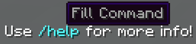
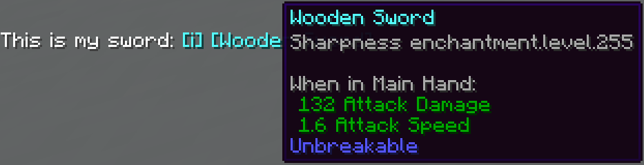
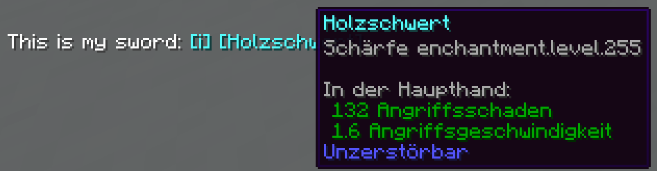

# Chat Format

On FarLands, we have many custom chat features.  This includes things
like nicknames, chat formatting, mentions and much more.

This page focuses on the following features:

- [Emotes](#chat-emotes)
- [Links](#chat-links)
- [Pings](#chat-pings)
- [Commands](#chat-commands)
- [Items](#chat-items)

## Chat Emotes

Emotes or Emojis can be pasted into chat in two ways: `/<emote>` or
`:<emote>:`.

With the command, a message can be added before the emote is pasted.
This is similar to Discord's `/shrug` command.

When using the `:<emote>:` syntax in a message, it will be immediately
replaced with that message, allowing styling to be applied.

> _Note: If you do not want your emote to be replaced in chat, put a
> backslash (`\`) before it_
>
> _`idk \:shrug:` -> `idk :shrug:`_

Some emotes are only supported in chat (`:<emote>:` format), because the formatting would not
work well otherwise.

The following emotes are currently supported, though more may be added
in the future:

| Name      | Emote              | Chat Only |
| --------- | ------------------ | --------- |
| tableflip | `(╯°□°）╯︵ ┻━┻`   | No        |
| unflip    | `┬─┬ ノ( ゜-゜ノ)` | No        |
| dab       | `ㄥ(⸝ ، ⸍ )‾‾‾‾‾`  | No        |
| shrug     | `¯\_(ツ)_/¯`       | No        |
| tm        | `™`                | Yes       |
| skull     | `☠`                | Yes       |

Example:

- `/shrug hello world` -> `hello world ¯\_(ツ)_/¯`
- `/dab` -> `ㄥ(⸝ ، ⸍ )‾‾‾‾‾`
- `Cool:tm:` -> `Cool™`

## Chat Links

Links in chat will be automatically highlighted aqua and underlined.
These links can be clicked and opened like any other.

> _Note: If you do not want this behaviour, use a backslash (`\`) before
> the link._

## Chat Pings

You can ping any player who has joined the server before with the
`@<username>` syntax. This will play a sound to the player and show
their full username in chat.  If you hover over the username, it will
show you stats about the player.

> _Note: If you do not want this behaviour, use a backslash (`\`) before
> the `@`._

You only need to use at least 3 characters from the player's username,
i.e. `ste` -> `steve`.  If there are multiple players whose names start
with the same letters, the plugin will chose the player with the most
playtime.

Example:

```
yo @funn
```

becomes


## Commands

One can link a command in chat by wrapping it with ``​`​``.
This will colour the link aqua and make it populate your chat bar when
clicked.

> _Note: If you do not want this behaviour, use a backslash (`\`) before
> the first ``​`​``._

Example: 

```
Use `/help` for more info!
```

becomes



## Items

You can show an item in chat using the `[i]` or `[item]` notation.  This
will show the item that you are currently holding in your hand.

> _Note: If you do not want this behaviour, use a backslash (`\`) before
> the `[`._

This will show the name of the item as well as the lore/enchantments
when you hover over the item in chat.

If the item has not been renamed, it will show in chat using the
localised version for whoever is looking at it.  If your Minecraft
language is set to German, it will show you the German name of the item.
If it's in English, then it shows the English name.

Example:

```
This is my sword: [i]
```

for English, becomes



and for German, becomes


