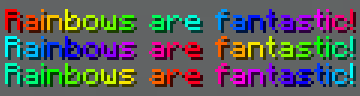

# MiniMessage

MiniMessage is the chat format parser that we use on FarLands.  You can
read its documentation [here](https://docs.advntr.dev/minimessage/format.html).

This page is a simplified version of the official MiniMessage
documentation, with a focus on the features that we allow on FarLands.

## Tags

MiniMessage formatting is done using a concept called "tags".  If you've
ever used HTML or many other markup languages, the syntax for these tags
should look familiar.

A tag in MiniMessage has a few different options for looks: `<tag>`,
`</tag>`, and `<tag:arg:arg>`.

`<tag>` is a start tag.  This means that it starts a tag section.  For
example `<yellow>Hello` will start a section with the tag `yellow` and
the content will be "Hello".

`</tag>` is a closing tag.  These are not required, and if they are not
included, MiniMessage will automatically close the tag at the end of
your input.  For example, `<yellow>Hello World</yellow>` and
`<yellow>Hello World` are identical.

Some tags require arguments to work, in order to pass arguments to a
tag, one must use this format: `<tag:arg1:arg2>`.  Depending on the
contents of the argument, it may require to be quoted.  To quote an
argument, wrap it in _either_ `'` or `"`, for example, `<tag:"my
argument">` or `<tag:'<3'>`

## Colours

> This feature is only enabled for members of the {{#rank adept}} rank
> and above.

To use a colour in chat, you can use the `<_colorname_>` tag.  This tag
accepts the name of a Minecraft colour.

The accepted names are: `black`, `dark_blue`, `dark_green`, `dark_aqua`,
`dark_red`, `dark_purple`, `gold`, `gray`, `dark_gray`, `blue`, `green`,
`aqua`, `red`, `light_purple`, `yellow`, and `white`.

> _Note: On FarLands, the `black` colour code is disabled for accessibility_

Examples:

```html
<gold>Hello World!</gold>
<red>Hello <blue>World</blue>!</red>
```

Which renders as


One can also use hexadecimal colours.  This is done in the same format,
but using the hexadecimal colour.  See below for examples.

> _Note: On FarLands, all very dark hex codes are disabled for accessibility_

Examples:

```html
<#facade>Hello World!</#facade>
<#0bbd9e>Hello <#d7483d>World</#d7483d>!</#0bbd9e>
```

Which renders as


## Decoration

> This feature is only enabled for members of the {{#rank adept}} rank
> and above.

Decoration tags are tags which can apply formatting to the following
text.

The valid tags are `bold`, `italic`, `underlined`, `strikethrough`, and
`obfuscated`.

These tags each have aliases that can be used in place of the actual
name.

| Decoration      | Alias(es) |
| --------------- | --------- |
| `bold`          | `b`       |
| `italic`        | `em`, `i` |
| `underlined`    | `u`       |
| `strikethrough` | `st`      |
| `obfuscated`    | `obf`     |

> _Note: On FarLands, the `obfuscated` tag is disabled for accessibility_

<!-- Example Needed -->

## Reset

The reset tag is used to clear all open tags, this is similar to the
`&r` code.  

This tag does not need to be closed and is just used as `<reset>`.

<!-- Example Needed -->

## Rainbow

> This feature is only enabled for members of the {{#rank adept}} rank
> and above.

The `rainbow` tag can be used to create a rainbow.

The syntax for the tag is `<rainbow>:[!][phase]`.

Arguments
- `phase` - A number which represents the start from the beginning of
  the rainbow.  If this is not specified, then it is `0`.
- `!` - a literal that reverses the rainbow if present

Examples:

```html
<rainbow>Rainbows are fantastic!</rainbow>
<rainbow:5>Rainbows are fantastic!</rainbow>
<rainbow:!5>Rainbows are fantastic!</rainbow>
```

Which renders as



## Gradient

> This feature is only enabled for members of the {{#rank adept}} rank
> and above.

The `gradient` tag can be used to create a gradient between two or more
colours.

Syntax: `<gradient:[color0]:[...colors]>`

Arguments
- `color` - Any colour that is discussed in the [colours](#colours) section

Examples:

```html
<gradient:red:blue>Hello World!</gradient>
<gradient:#09816b:#00aa00:#09816b>Hello World!</gradient>
```

Which renders as


