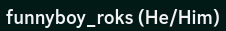

# Stats

You can view a player's stats by hovering over their name when it shows
in chat or by running `/stats [username]`.

A players stats consist of:

- Rank
- Pronouns
- Time Zone
- Time Played
- Deaths
- Votes (Month/Season/All Time)

## Pronouns

Your pronouns can be set by using the `/pronouns` command.

Usage:

```
/pronouns set <subject>/<object>
/pronouns show-on-discord <true|false>
```

By default your pronouns will not show on Discord, but if you enable it
with `/pronouns show-on-discord true`, they will to show the right of
your name in parenthesis:



## Time Zone

You can set your time zone with the `/timezone` command.

Usage:

```
/timezone set <timezone>
```

The tab completion should help with the time zones, but you can view a
full list [here](https://gist.github.com/funnyboy-roks/5d1be107091dd0d623480b20ada84bc3)
