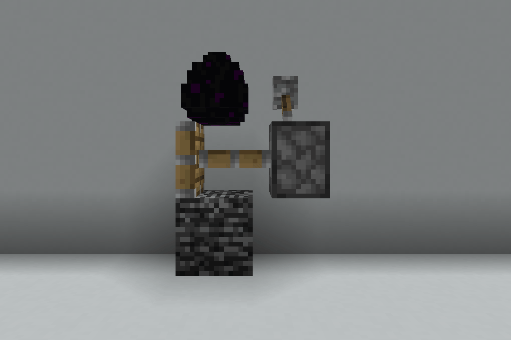
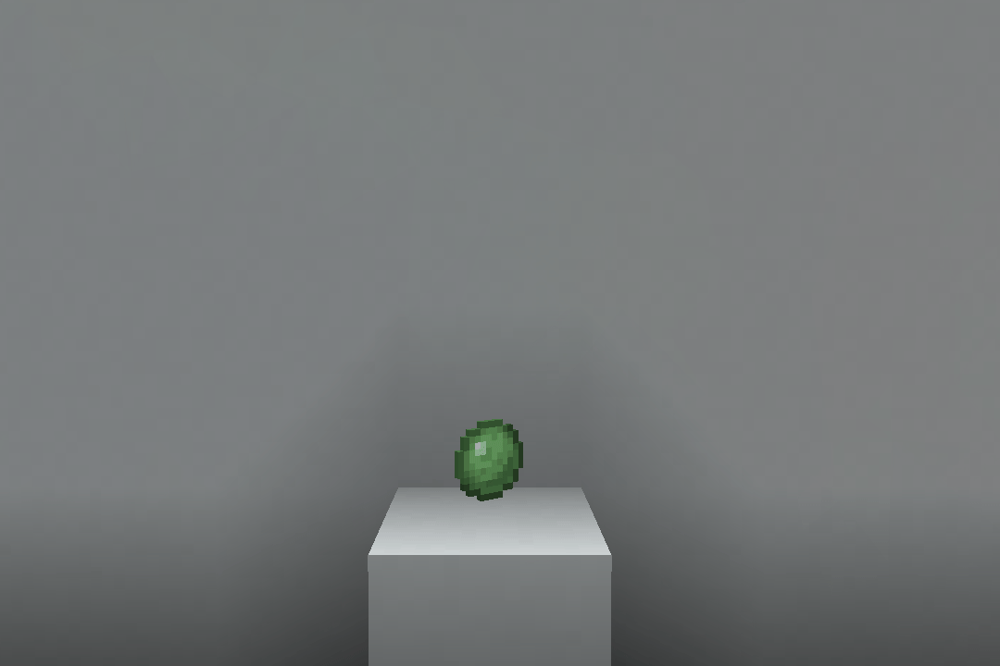
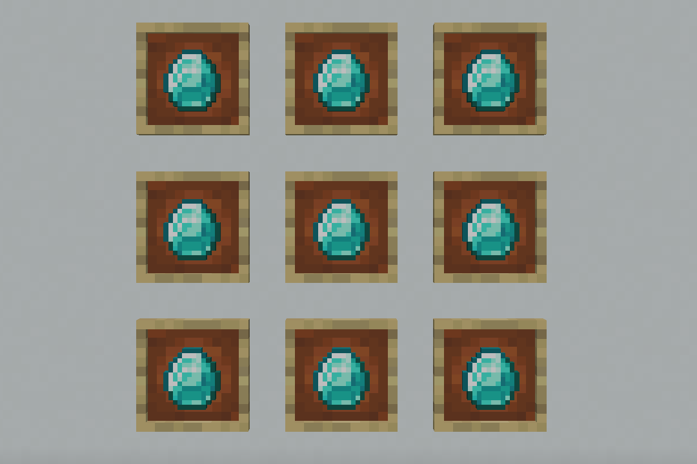
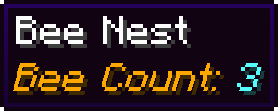
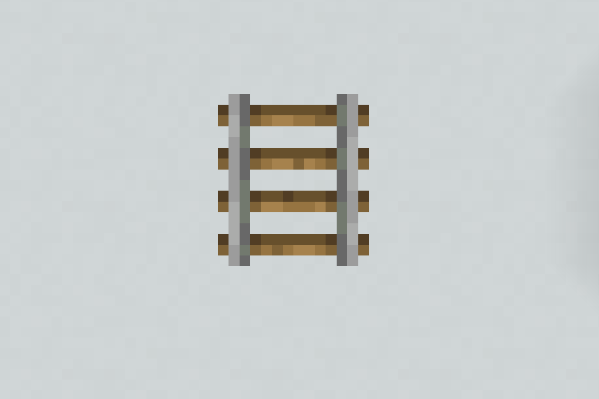
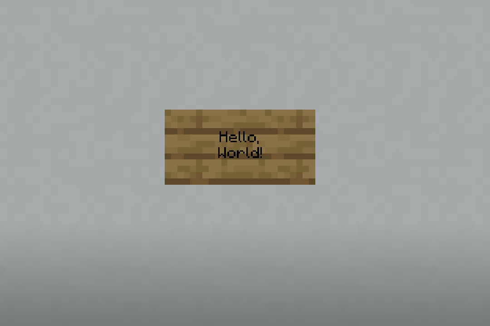
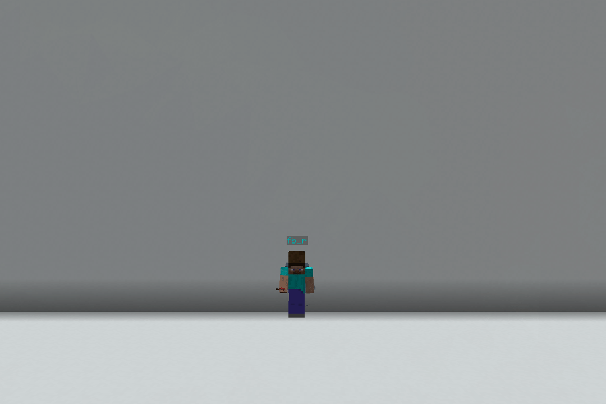
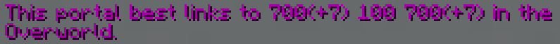
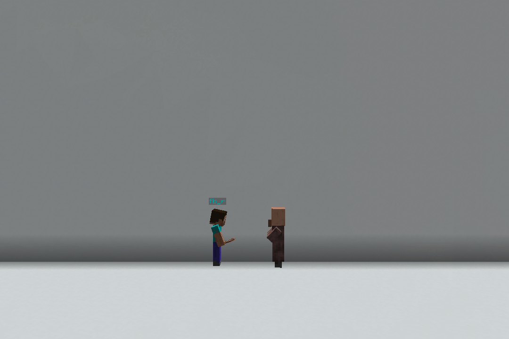

# Quality of Life Features

These features exist to improve the quality of life on the server and
allow for a better survival experience.

## Bedrock Breaking

This is a feature/bug in Vanilla but has been patched by paper.  To
replace this mechanic, we implemented a method similar to the old 1.12
method of breaking bedrock and end portal frames.

To break a bedrock block, one must drop a dragon egg from the end of a
piston head, as shown below in the GIF.

_Note: You can't break the bottom bedrock in the world using this
method._

## Slime Chunk Finder

One can easily find a slime chunk by throwing a slime ball on the
ground!  If it bounces, it's in a slime chunk.

## Invisible Item Frames

Item frames with an item in them can be made invisible by splashing a
potion of invisibility on the item frames.  The frame will then be
invisible until the item is removed.

## Bee Counts

You can see the amount of bees in any Bee Nest or Bee Hive by right
clicking it or picking it up!

## Rail Rotation

Rails are basically impossible to place the correct way on the first try.
On FarLands, you can Shift + Right Click a rail to change its rotation.

## Unwaxable Signs

One is able to unwax a waxed sign by Shift + Right Clicking on a waxed
sign while holding an axe.

## Firework Launch

In order to help with flying using the Elytra, you can right click with
a firework rocket on the ground in order to start gliding.  This feature
can be toggled with `/config firework-launch <on|off>`

## Nether Portal Link Finder

See where a nether portal portal links by Shift + Right Clicking one of
the portal blocks.

## Leashable Entities

Many entities which are not normally leashable, can be.  These include
Villagers, Turtles, and more!

## Death Compass

A compass can point to your death location in the event of your death so
that you can easily find your items.

Alternatively, the coordinates of you death are printed in the chat and
can be found again with the `/lastdeath` command.

## Dragon Egg

**Pickup With Click** - Click on a dragon egg to pick it up!  
**Infinite Dragon Eggs** - Every time that the dragon is killed, a _new_ dragon egg will form.

## PTime and PWeather

> This feature is only enabled for members of the {{#rank sage}} rank
> and higher

The `/ptime` and `/pweather` commands can be used to control the time
and weather that the player sees.  This can be useful when building to
see what your build looks like or just because rain is annoying.
