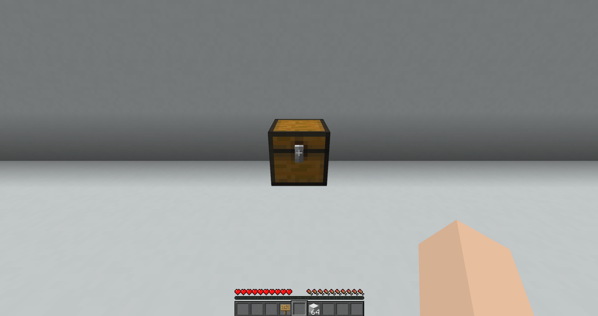

# Creating a Shop

Creating a shop is very straightforward.  You need to place a sign on a
chest.

On this sign you need to have four lines.

1. `[shop]`
1. The price.
1. The amount you're selling
1. Shop Type: `sell`, `buy`, or `barter`
    - The types described [here](./types.md)



In this GIF, the sign is formatted as such:

```
[shop]
   1
  16
 sell
```

If we translate this into a sentence, it means that I'm creating a shop
 where I'm `sell`ing `16` items for `1` diamond.


Once you've placed the sign, the chat will prompt you to click it with
the item or items that a related to your choice for type.
